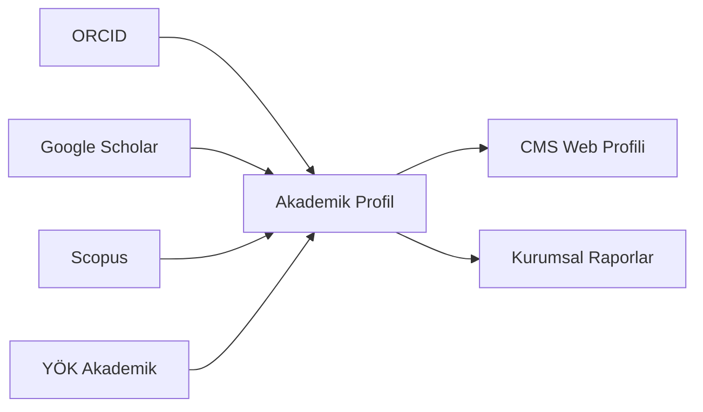

# Akademik Profil Yönetim Sistemi

Akademik personelin bilimsel çalışmalarını, yayınlarını, projelerini ve akademik kimliklerini yöneten sistem.

## 🎯 Amaç

Akademisyenlerin tüm akademik faaliyetlerinin tek bir platformda toplanması, görünürlüğünün artırılması ve kurumsal araştırma kapasitesinin raporlanması.

## 📋 Kapsam

- Akademik CV yönetimi
- Yayın ve atıf takibi
- Proje portföyü
- Araştırma çıktıları
- Akademik teşvik hesaplama
- ORCID ve akademik ID entegrasyonları

## ✨ Temel Özellikler

### Profil Yönetimi
- Akademik özgeçmiş
- Araştırma alanları ve uzmanlıklar
- Eğitim geçmişi
- İş deneyimi
- Ödüller ve onursal unvanlar
- Medya görünürlüğü

### Yayın Yönetimi
- Makale kayıtları
- Kitap ve kitap bölümleri
- Konferans bildirileri
- Patent ve faydalı modeller
- Teknik raporlar
- Otomatik atıf çekme (Google Scholar, Scopus, WoS)

### Proje Portföyü
- Yürütücü olduğu projeler
- Araştırmacı olduğu projeler
- Proje bütçeleri
- Proje çıktıları
- TÜBİTAK, BAP, AB projeleri

### Akademik Metrikler
- H-index
- Toplam atıf sayısı
- i10-index
- Yayın sayıları (kategorilere göre)
- Proje bütçe toplamları

### Akademik Teşvik
- Otomatik puan hesaplama
- Dönemsel başvuru yönetimi
- Belge oluşturma
- Başvuru takibi

### Dış Entegrasyonlar
- ORCID senkronizasyonu
- Google Scholar çekme
- Scopus Author ID
- Web of Science ResearcherID
- YÖK Akademik
- DergiPark

### Kurumsal Araştırma Profili
- Fakülte/bölüm araştırma profili
- Araştırma grupları
- Kurumsal metrikler
- Benchmark raporları

## 🔗 Entegrasyonlar

| Sistem | Entegrasyon Türü | Açıklama |
|--------|------------------|----------|
| SSO | Kimlik Doğrulama | Merkezi oturum |
| Personel Sistemi | Veri Paylaşımı | Temel personel bilgileri |
| Proje Yönetimi | Veri Çekme | Proje bilgileri |
| ORCID | API | Yayın senkronizasyonu |
| Google Scholar | Scraping/API | Atıf verileri |
| Scopus | API | Yayın ve atıf |
| YÖK Akademik | API | Resmi kayıtlar |
| Dergi Yönetimi | Veri Paylaşımı | Kurum içi yayınlar |
| CMS | Veri Aktarımı | Web profil sayfaları |

## 👥 Kullanıcı Rolleri

| Rol | Yetkiler |
|-----|----------|
| **Akademisyen** | Kendi profil yönetimi |
| **Bölüm Sekreteri** | Bölüm akademisyenlerini görüntüleme |
| **Bölüm Başkanı** | Bölüm raporları |
| **Dekan** | Fakülte raporları |
| **BAP Koordinatörü** | Proje raporları |
| **Rektörlük** | Kurumsal raporlar |
| **Sistem Yöneticisi** | Tam yetki |

## 🗃️ Veritabanı Şeması (Temel)

```
academic_profiles
├── id
├── employee_id
├── orcid
├── google_scholar_id
├── scopus_author_id
├── wos_researcher_id
├── yok_academic_id
├── research_areas[]
├── bio
├── website
├── social_links (JSON)
└── timestamps

publications
├── id
├── profile_id
├── type (article, book, conference, patent)
├── title
├── authors[]
├── journal/conference
├── year
├── volume
├── issue
├── pages
├── doi
├── issn
├── index_type (SCI, SSCI, AHCI, vb.)
├── citation_count
├── external_ids (JSON)
└── timestamps

projects
├── id
├── profile_id
├── role (yürütücü, araştırmacı, danışman)
├── title
├── funding_agency
├── project_type
├── budget
├── start_date
├── end_date
├── status
├── outputs[]
└── timestamps

citations
├── id
├── publication_id
├── source (scholar, scopus, wos)
├── count
├── fetched_at
└── timestamps

academic_metrics
├── id
├── profile_id
├── h_index
├── total_citations
├── i10_index
├── publication_counts (JSON)
├── calculated_at
└── timestamps

incentive_applications
├── id
├── profile_id
├── period
├── total_points
├── status
├── submitted_at
├── approved_at
└── timestamps
```

## 🛠️ Teknik Gereksinimler

### Backend
- Runtime: Node.js 18+ / Python 3.11+
- Framework: NestJS / FastAPI
- Queue: Bull / Celery (veri çekme işleri)

### Frontend
- Framework: React 18+ / Next.js 14+
- Charts: Recharts / D3.js
- UI: Tailwind CSS

### Veritabanı
- Primary: PostgreSQL 15+
- Cache: Redis

### Dış Servisler
- ORCID API
- Scopus API
- CrossRef API

## 📁 Modül Yapısı

```
05-akademik-profil-yonetim-sistemi/
├── src/
│   ├── modules/
│   │   ├── profiles/          # Profil yönetimi
│   │   ├── publications/      # Yayın yönetimi
│   │   ├── projects/          # Proje portföyü
│   │   ├── citations/         # Atıf takibi
│   │   ├── metrics/           # Akademik metrikler
│   │   ├── incentives/        # Akademik teşvik
│   │   ├── sync/              # Dış kaynak senkronizasyonu
│   │   └── reports/           # Raporlama
│   ├── jobs/                  # Arka plan işleri
│   └── integrations/          # Dış API entegrasyonları
├── tests/
├── docs/
└── docker/
```

## 🚀 Yol Haritası

### Faz 1 - Temel (MVP)
- [ ] Profil CRUD
- [ ] Manuel yayın girişi
- [ ] Temel metrikler

### Faz 2 - Genişletme
- [ ] ORCID entegrasyonu
- [ ] Google Scholar çekme
- [ ] Proje modülü

### Faz 3 - İleri Özellikler
- [ ] Scopus/WoS entegrasyonu
- [ ] Akademik teşvik hesaplama
- [ ] Kurumsal araştırma dashboard
- [ ] Araştırma grubu yönetimi

## 📊 KPI'lar

- Profil tamamlanma oranı
- Veri güncellik oranı
- Kurumsal yayın artış hızı
- Atıf büyüme trendi

## 🔄 Veri Senkronizasyonu



---

**Modül Durumu:** 🔴 Geliştirme Başlamadı

**Öncelik:** Orta

**Tahmini Süre:** 4-5 ay
