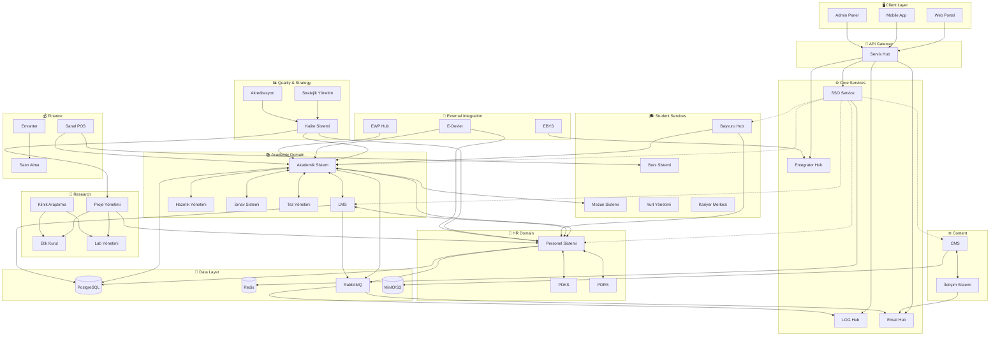
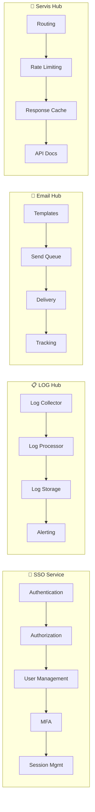
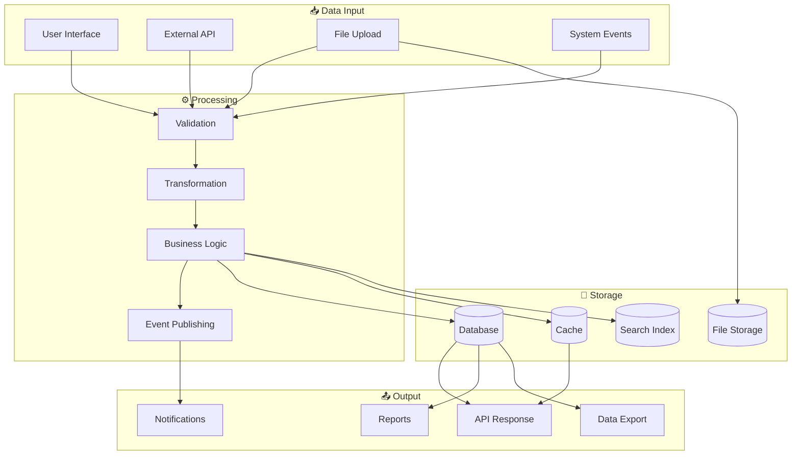
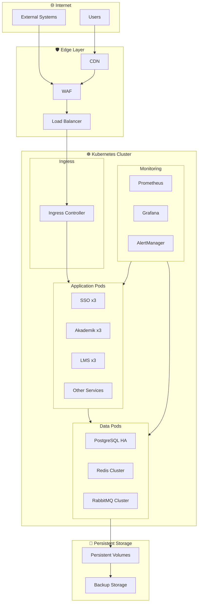
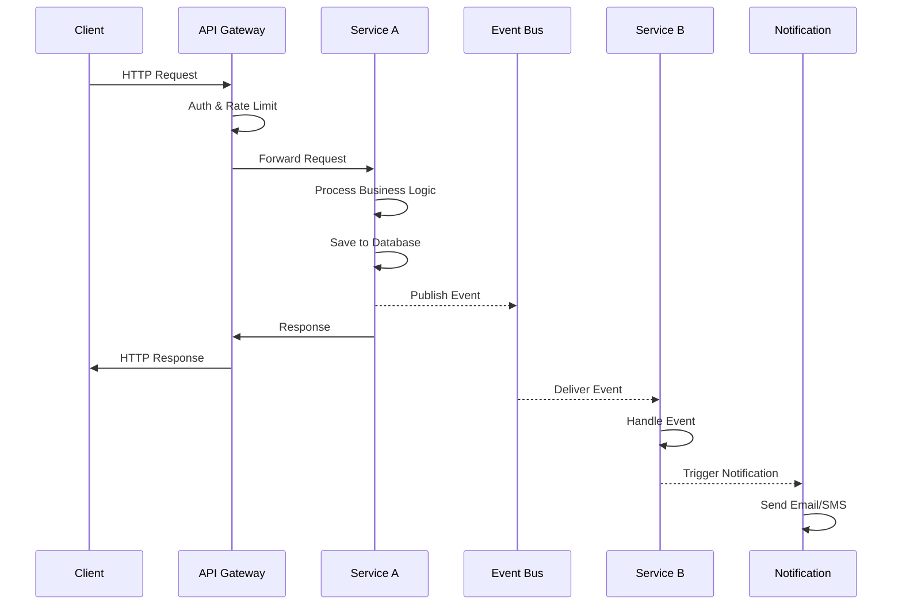
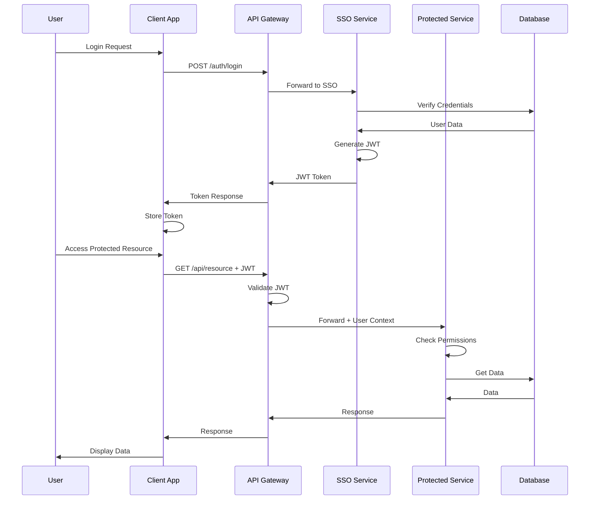

# Open University - Entegrasyon Şeması

Bu doküman sistemler arası entegrasyonların görsel şemasını içerir.

## Genel Sistem Entegrasyonu

## Core Services Detay

## Veri Akış Şeması

## Deployment Topolojisi

## Event Flow

## Kimlik Doğrulama Akışı

---

## Nasıl Kullanılır

Bu diyagramlar [Mermaid](https://mermaid.js.org/) formatındadır. Görüntülemek için:

1. **GitHub**: GitHub Markdown dosyalarında otomatik render edilir
2. **VS Code**: "Markdown Preview Mermaid Support" extension
3. **Online**: [Mermaid Live Editor](https://mermaid.live/)
4. **Docusaurus/GitBook**: Native Mermaid desteği

---

*Diyagramlar Open University v1.0.0 mimarisini yansıtmaktadır.*
